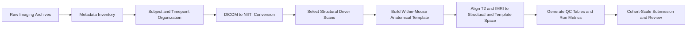

# Mouse MRI/fMRI Project Bundle

I build imaging pipelines that try to stay reproducible from raw data intake to
analysis-ready outputs, even when multiple modalities and timepoints have to
share the same transform logic. This repository is a public, sanitized code
sample from my longitudinal mouse MRI and fMRI workflow, covering raw archive
organization, structural alignment, multimodal integration, and QC.

The code covers the pipeline from raw imaging archives through organized
subject/timepoint structure, DICOM-to-NIfTI conversion, anatomical alignment,
multimodal integration, QC, and cohort-scale submission.

The project is organized as a workflow bundle rather than a general-purpose
software package. It is meant to show how I structure imaging pipelines that
need to stay reproducible across multiple scan types and timepoints.

## Technical Highlights

- reproducible raw-data organization and DICOM metadata inventory
- subject/timepoint longitudinal restructuring before conversion and analysis
- anatomical template building used as a shared reference for later modalities
- multimodal transform chaining for T2-weighted and 4D fMRI data
- explicit QC outputs and low-memory handling for operational robustness

## Workflow Diagram

## Repository Layout

- `parker_mouse_longitudinal/`
  end-to-end longitudinal mouse pipeline, including raw-data inventory,
  organization, conversion, anatomical processing, multimodal alignment, QC,
  and batch submission

## What A Reviewer Can Look For

- pipeline decomposition into clean stages instead of one monolithic script
- mixed Bash and Python workflow design for real imaging operations
- deliberate handling of multimodal transform chains rather than isolated
  one-off registrations
- QC generation as a first-class output rather than an afterthought
- awareness of compute constraints, especially for 4D fMRI handling

## Public Release Notes

This is a public-safe copy of the original internal bundle.

- workflow structure and naming style were preserved
- lab-specific paths were replaced with placeholders
- environment-specific details were generalized where needed

This makes the repository suitable as a code sample and project overview, even
though some local configuration would still be required to run it directly.
